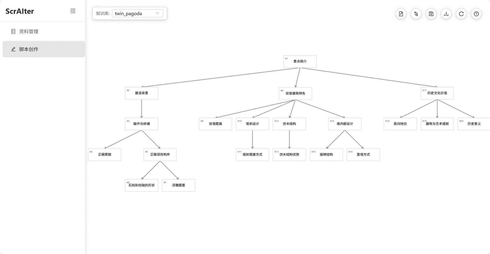

# ScrAIter

Github repo: https://github.com/willow-hu/ScrAIter

ScrAIter = Script + AI + writer, 是一个AI驱动的交互游戏脚本创作工具，目的是针对一个遗址地创作出一个交互导览游戏（参考我的另一个应用“双塔导览剧情游戏”）的脚本。

用户将上传相关资料到系统，AI将首先创作出一个基础树状结构，表示剧情分支，而后每个节点上用户都可以让AI生成一段文字，也就是NPC说的话。用户可以随时修改树状结构和节点内容。具体可[参考说明](ProjectOverview.pdf)。

⚠️ 注：当前为只读展示版，上传、修改、保存和 AI 生成功能暂未开放。
