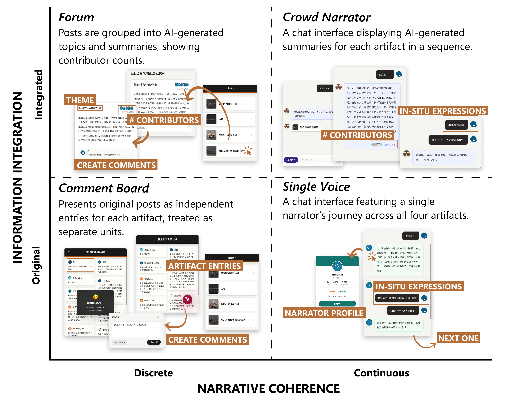

# 博物馆UGC展示原型

Github repo: https://github.com/willow-hu/museum-ugc-prototype

本应用为科研项目中用户实验所使用的原型。从小红书和大众点评的用户帖子中收集了若干条游客关于文物的评论和想法，在该原型中用四种方式展示出来。游客在游览博物馆观察文物的时候可以同时查看其他游客留下的评论。

根据两个维度共设计了四种模式：



更多详情可参考论文：

```latex
@inproceedings{10.1145/3772363.3798691,
author = {Hu, Wenzhe and Fan, Shuran and Li, Yue},
title = {Read and Reflect: Exploring How the Display of User-Generated Content Shapes In-Situ Museum Expression},
year = {2026},
series = {CHI EA '26}
}
```


注：展示为纯前端原型。留言、话题回复和导览进度仅保存在当前页面，刷新后重置。

